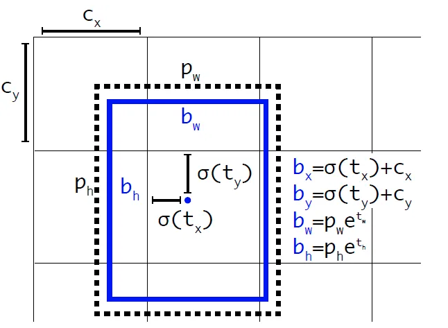

YOLOv3 for Object Detection 🛠️
===============================

This project demonstrates the usage of **YOLOv3** for real-time object detection. Below is an explanation of how YOLOv3 works and why it's still relevant for various applications, along with practical use cases.

### Object Detection Example 🎯

**Original photo** by *Heather M. Edwards* on Unsplash.\
This object detection example is powered by YOLOv3.

### What is YOLOv3? 🤖

**YOLOv3** (You Only Look Once) is a widely-used Convolutional Neural Network (CNN) model designed for real-time object detection. Released in 2018 by *Joseph Redmon* et al., it was one of the top-performing models at its time. Even today, it's highly efficient in various applications, such as:

-   **Autonomous driving:** Detecting vehicles and pedestrians.
-   **Wildlife monitoring:** Identifying animals in forests.
-   **Manufacturing:** Detecting parts and components on assembly lines.

It processes images at 45 frames per second on a Titan X GPU, maintaining high accuracy and speed.

### YOLOv3 Architecture ⚙️

YOLOv3 uses a monolithic architecture. It detects objects in images by looking at them only once, a major innovation in comparison to older object detection systems that required multiple stages of processing. YOLOv3 directly outputs both the bounding boxes and class predictions for detected objects in a single forward pass.

-   **DarkNet-53**: YOLOv3's backbone is DarkNet-53, a deep CNN with 53 layers and skip connections. Skip connections enable faster training and inference by allowing the network to "skip" layers and avoid degradation when networks become too deep.

### How YOLOv3 Works 🌐

YOLOv3 uses the following key concepts:

-   **Anchor Boxes**: These are predefined boxes with fixed ratios, used to predict bounding box dimensions and positions.
-   **Bounding Boxes**: For each object detected, a bounding box is drawn to show its position within the image. YOLOv3 identifies bounding boxes in three different scales for detecting objects of varying sizes (small, medium, large).

### Object Detection in YOLOv3

In YOLOv3, object detection is performed at three distinct scales to recognize objects of different dimensions in an image. These scales are based on three different layers of the neural network, where feature maps are used for detecting objects of varying sizes.

#### 1\. **First Object Detection Stage (82nd Layer):**

The first detection occurs at the 82nd layer, responsible for detecting the largest objects in the image. At this stage:

-   After passing through DarkNet-53, the feature map has a size of **19x19x1024**.
-   For simplicity, we refer to this as an image of size **19x19** (ignoring depth).
-   A 1x1 convolution is applied, resulting in an output of **19x19x(B x (5 + C))**, where:
    -   **B** is the number of bounding boxes predicted for each image cell. In YOLOv3, **B = 3**.
    -   **5** represents the bounding box attributes:
        -   **(tx, ty)**: offset of the bounding box center from the cell.
        -   **(tw, th)**: width and height relative to the anchor box size.
        -   **p₀**: objectness score (probability that the cell contains an object).
    -   **C** is the number of classes. YOLOv3 is often trained on the COCO dataset, which has **80** classes.

Thus, for the first detection stage, there are **19x19x3 = 1083** bounding boxes identified, each described by attributes **(tx, ty, tw, th, p₀, {p₁, p₂, ..., pc})**.

The class score for each bounding box is calculated by multiplying the objectness score **p₀** by the highest class probability **MAX({p₁, p₂, ..., pc})**.

#### 2\. **Second Object Detection Stage (94th Layer):**

-   After the first detection, the feature map is up-sampled from **19x19** to **38x38**, and passes through several convolutional layers and skip connections.
-   The resulting image is concatenated with the output of the 61st layer (which has the same size of **38x38** but represents higher-resolution features).
-   This enhances the ability to detect medium-sized objects.
-   At the 94th layer, the second detection occurs, resulting in **38x38x3 = 4332** candidate bounding boxes, similar to the first detection process.

#### 3\. **Third Object Detection Stage (106th Layer):**

-   Finally, the feature map is up-sampled again from **38x38** to **76x76**, and it is concatenated with the output of the 36th layer (also **76x76**).
-   This enables the detection of smaller objects.
-   The third and final detection occurs at the 106th layer, producing **76x76x3 = 17328** candidate bounding boxes.

### YOLOv4, YOLOv5, and PP-YOLO 📊

After YOLOv3, newer versions like **YOLOv4**, **YOLOv5**, and **PP-YOLO** were released. Each of these versions built upon YOLOv3, incorporating improvements for even higher accuracy and faster inference. However, YOLOv3 remains popular due to its influence on modern object detection architectures.

-   **YOLOv4**: Last version that uses DarkNet-53 as its backbone.
-   **YOLOv5**: Controversial release due to missing peer reviews at the time of its launch.
-   **PP-YOLO**: PaddlePaddle's re-implementation of YOLOv3.

### Non-Maximum Suppression (NMS) ⛔

After generating bounding boxes, YOLOv3 applies **Non-Maximum Suppression (NMS)** to remove redundant boxes that overlap. This step ensures that only the most confident detections are retained for final output.

* * * * *

### Credits 📝

-   Understand the YOLOv3 architecture in-Depth from [youtube video](https://www.youtube.com/watch?v=9fhAbvPWzKs)
-   YOLOv3 architecture explained with inspiration from [this article on Medium](https://medium.com/data-reply-it-datatech/yolo-v3-for-object-detection-f9f5637cf428).
